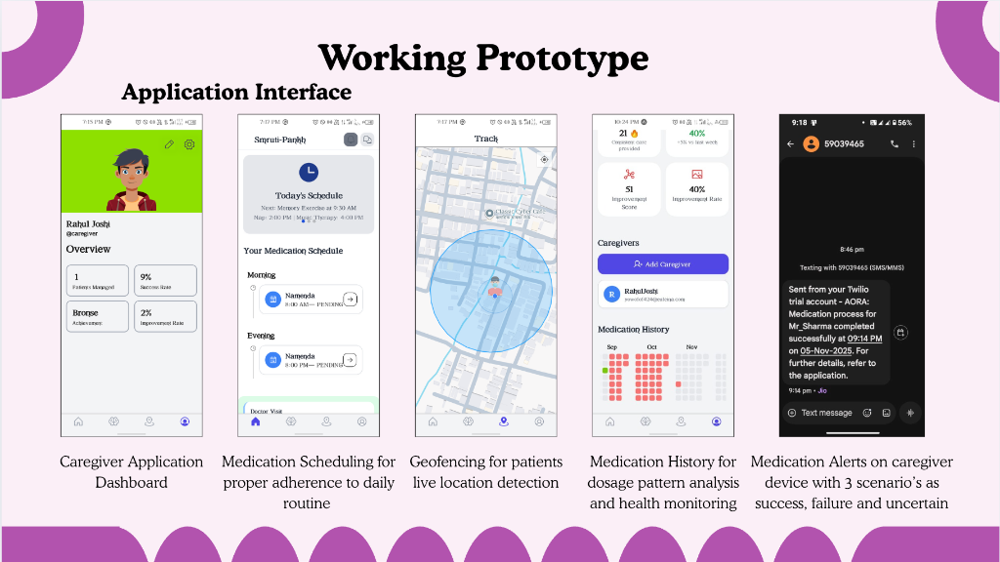
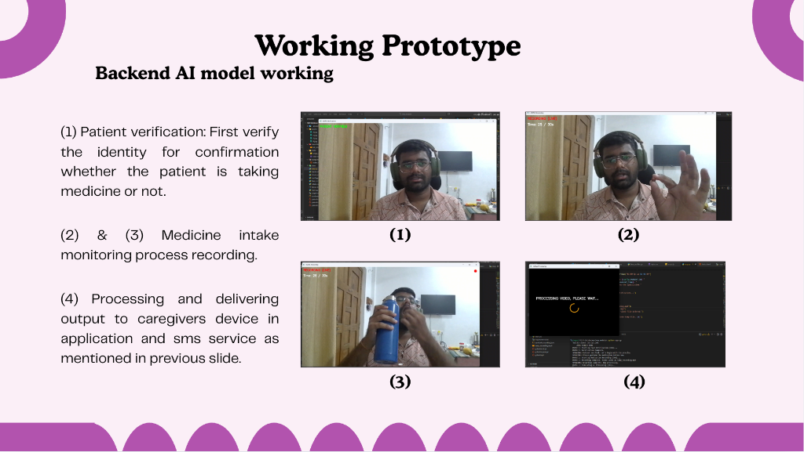
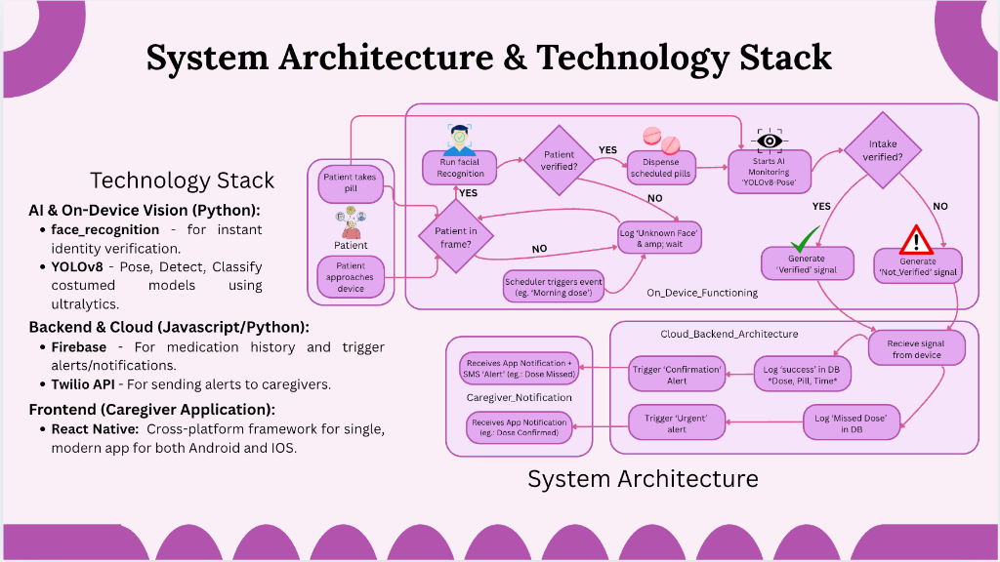

  <h1>Smruti-Pankh (Smritipankha)</h1>
  <h3><i>Empowering Caregivers, Protecting Memories</i></h3>
  
<b>A Game-Changer in AI-Driven Healthcare for Alzheimer’s & Dementia Care</b>

---

---

## 📖 Overview

**Smritipankha** is a novel, AI-powered ecosystem designed to bridge the gap between Alzheimer's patients and their caregivers. By leveraging advanced On-Device Computer Vision and IoT integration, we provide a safety net that ensures medication adherence, location safety, and emotional well-being—without compromising privacy.

> *"We don't just track; we care."*

## 🚨 The Problem

Alzheimer's and Dementia affect millions globally, creating immense pressure on caregivers:
*   **Medication Non-Adherence:** Patients often forget doses or overdose, leading to severe health decline.
*   **Wandering Risk:** 60% of dementia patients wander, risking injury or getting lost.
*   **Caregiver Burnout:** Constant monitoring is physically and emotionally draining.

## 💡 The Solution: A Novel Approach

Smritipankha introduces a **distributed care system** that functions autonomously:
1.  **AI-Verified Medication:** Unlike simple alarms, our system uses **Computer Vision** to *watch* and *verify* if the patient actually swallows the pill.
2.  **Geofencing & Safety:** Real-time tracking with "Safe Zones". If a patient wanders, caregivers get an instant alert with live location.
3.  **Privacy-First:** All facial recognition and behavior analysis happen **On-Device**, ensuring patient data never leaves the home unnecessarily.

---

## 📱 Working Prototype

Our solution is not just a concept—it is a fully functional prototype.

### Caregiver Application & Dashboard
The command center for caregivers to manage schedules, view history, and track location.

### Backend AI & Verification Logic
How our system "sees" and "thinks" to ensure safety.

1.  **Patient Verification:** Identifies the patient.
2.  **Action Recognition:** Detects "pill-to-mouth" and swallowing actions.
3.  **Processing:** Analyzes video feed in real-time.
4.  **Alert Generation:** Triggers SMS/App notifications based on success or failure.

---

## 🏗️ System Architecture & Technology Stack

Our architecture is built for reliability, speed, and privacy.

### Tech Stack

| Component | Technology | Role |
| :--- | :--- | :--- |
| **Edge AI / Vision** | **Python (YOLOv8, Face_recognition)** | Runs on local device for real-time detection & privacy. |
| **Mobile App** | **React Native** | Cross-platform (iOS/Android) for caregivers. |
| **Backend / Cloud** | **Firebase** | Real-time database for sync & notifications. |
| **Communications** | **Twilio API** | Critical SMS alerts and emergency calls. |
| **Hardware** | **Raspberry Pi / Jetson (simulated on PC)** | The "brain" placed in the patient's room. |

---

## 🚀 Market Potential & Impact

*   **Growing Market:** With the aging global population, the Elder Care market is projected to reach **$2 Trillion**.
*   **Scalability:** Our software-first approach allows deployment on generic hardware (cameras/phones), making it affordable.
*   **Novelty:** We are the first to combine **Verification (Vision)** with **Management (App)** in a consumer-friendly package.

---

  
<i>Built with ❤️ for a safer tomorrow.</i>

